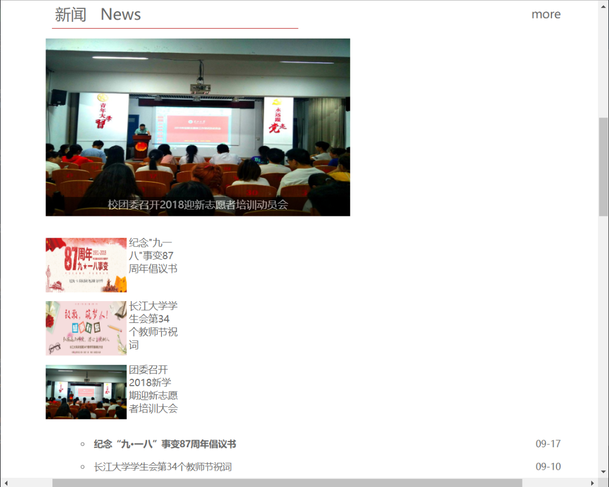
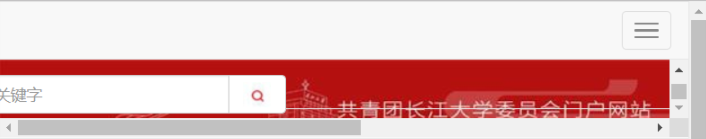
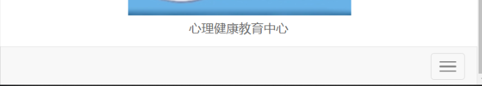

# 目录
<!-- TOC -->

- [目录](#目录)
- [前言](#前言)
- [网页概述](#网页概述)
    - [网页中存在的问题](#网页中存在的问题)
        - [一](#一)
        - [二](#二)
        - [三](#三)
        - [四](#四)
        - [五](#五)
- [总结](#总结)

<!-- /TOC -->
# 前言
首先非常感谢学长能给我这次宝贵的机会，还记得第一次见面会上老师要我们牢记自己的最初的理想，我现在还不敢忘记我想加入在线的初心：我希望自己能变得更好结交更多的厉害的同学。而在在线的时间我也感觉到了我的理想的实现，我不仅结交到了更多的朋友也感觉到了自己的进步。而这次写网页更是让我收获良多，所以我还是希望加入在线。
# 网页概述
## 网页中存在的问题
本次写网页由于本人实力的限制所以还有一些未解决的问题
### 一

由于时间原因我还没学习js，所以图中的微信的二维码我没有用js特效写而是用的bootstrap的弹出模板，所以要使用二维码需要点击微信图标上方一点。
### 二

同样的原因由于不懂js，对于新闻板块我只设置了图片的轮播，而图片与旁边图文的联动我没有设置。
### 三

对于bootstrap框架我学习的也不深，在响应式布局时当窗体缩小到这个程度时会出现滚动条并且块的大小也不协调（响应式布局最完美的时候是当窗体再缩小一点的时候）。
### 四

同样由于对bootstrap的原理不够了解，我在导航栏中嵌套了东西并调整大小后当窗体缩小后，导航栏的响应式布局会错位并且出现滚动条。
### 五

与四的问题有点相似的是网页底部的导航栏在缩小进入响应式布局后背景图片会消失，并且折叠的那个三个横线的标志点击后无响应。
# 总结
在这次写网页完成任务的过程中我感受到了我原来其实根本没有用尽全力（人你不逼自己一下你都不知道自己的潜力有多大），而在写完网页后我也认识到我网页中的不足，我准备在下一阶段认真学习js，并且对网站进行进一步完善，对于许多需要js实现或需要js才能更好体现出来的地方，进行改写。最后用在线的十字准则结尾

&emsp;&emsp;&emsp;&emsp;&emsp;&emsp;效率  守时  舍得  细节  责任
